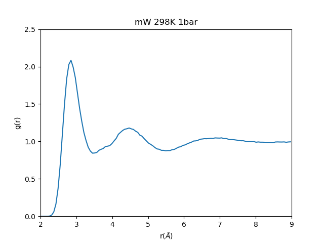

# A general approach to extend Python with Fortran

## Example: 
* computing g(r) of mW [1] water model at 298 K  


## Required:
* Python 3.7 (Recommended)
* ctypes (already included in Python standard library)
* numpy==1.18.x 
* matplotlib
* A Fortran compiler supporting Fortran2003 standard

## Instructions:

* Download the repository

```
git clone https://github.com/jingxiangguo/Tutorial.git 
```

* Make the shell script "compile" exectuable

```
chmod 755 compile
```

* Modify the compiler options in the shell script "compile" if needed

* The default is Intel Fortran (works on juniper)

* Run the "compile"

```
./compile
```
* Run Python script 

```
python calc_pair_correlation.py 
```


## Reference:

[1]: Molinero, V., & Moore, E. B. (2009). Water Modeled As an Intermediate Element between Carbon and Silicon. J. Phys. Chem. B, 113(13), 4008–4016. https://doi.org/10.1021/jp805227c
